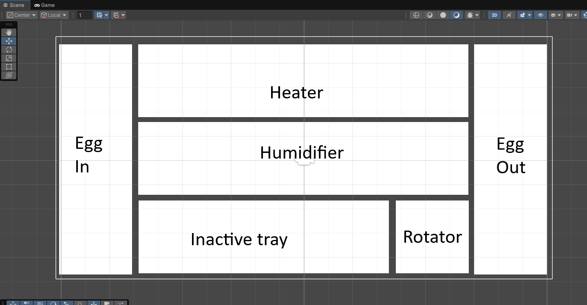
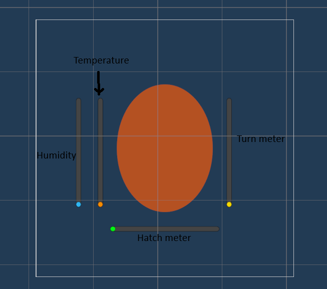
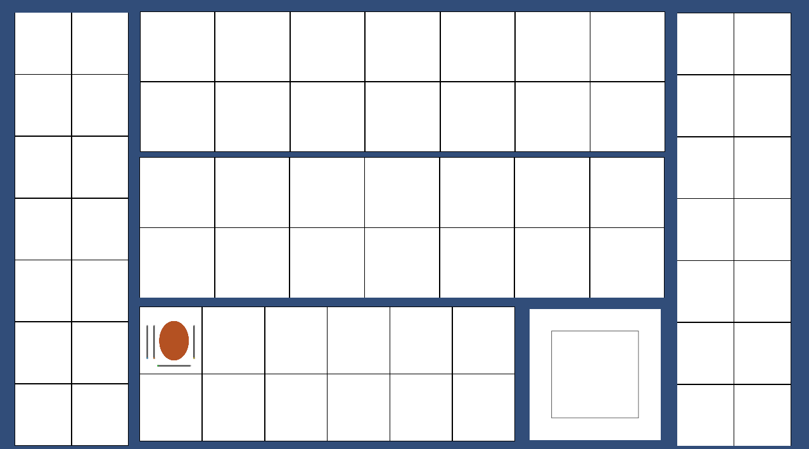
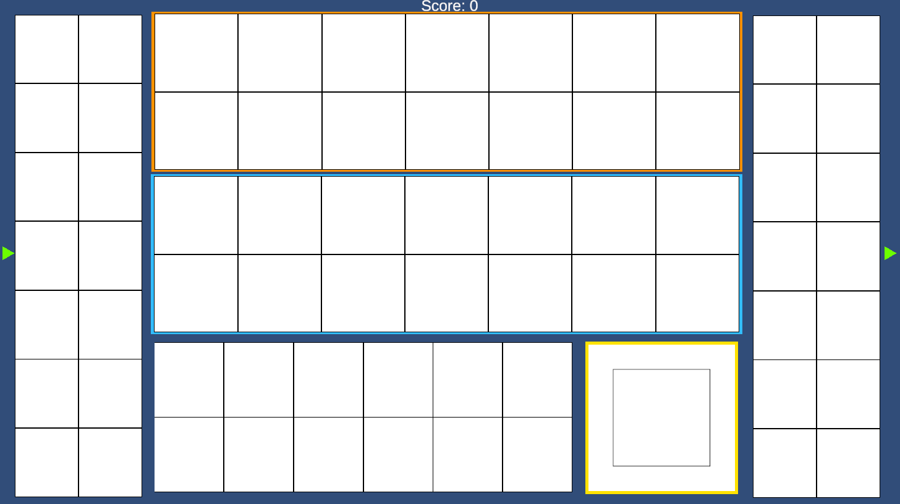

# \Fundamentals of Game Development Resit

**Unit Name:** \Fundamentals of Game Development

**Student Name:** \Ben Phillips

**Student ID:** \2403782

**Total Word Count:** \[XXXX]

**Documentation Link:** \[URL]

**Repository Link:** \(https://github.com/DragonH0rnet/Uni-Y1-Fundamentals-Resit)

**Build Link:** \[URL or Embed]

**Video Demonstration Link:** \[URL or Embed]

---

## Abstract *(Approx. 5–10% of word count | 100–300 words)*

Summarise your task, goals, approach, and final outcome. What was the intent of your work? What is the most important thing to know before reading on?
#
My goal for this project is to create a WebGL game individually, following the theme 'Egg'. I am instructed with interpreting this creatively and have decided to attempt a sort of time-management simulation where the player hatches eggs by moving them between machines to keep them stable. For example maybe a heater, humidifier and a turning machine. Players would need to transfer eggs between these to make sure they remain stable and monitor their conditions. 
---


## Research *(Approx. 20-30% of word count)*

### What sources or references have you identified as relevant to this task?

I researched the basics of what incubators do to determine what machines the player should manage, deciding that I should have players manage temperature, humidity and turning off the eggs. The sources for this where various google searches for the basic information, then I verified it further mostly using this website; (Setting Up an Incubator for a Successful Hatch, 2020)

I also used some more sources as specified in the sources section; (How to convert the mouse position to world space in Unity, 2022) and (Unity Learn, s.d.). These helped a lot with fixing some of the main issues I had with the project. I did do additional research outside of these sources to help with various bugs, but they never requried me using a proper source, mostly just skimming off of summaries or google's AI overview giving me insight that allowed me to solve the problem. I never directly used any code or material from these vague sources and just used them to gain further insight into what the problem might be in my own code. 

I didn't do much creative research other than the previously stated look into the function of incubators to inform the core of the game mechanics, mostly due to the simplicity of the project. This was very useful though since I originally had the rough idea of a management game involving the incubation of eggs, but was uncertain as to what mechanics I should include or how many I should use. This research helped me specify the mechanics and the number of them to make a hopefully more balanced experience. For example, too many mechanics may have become too difficult or overwhelming for the player and unrealistic mechanics may have affect immersion or been confusing for the player.

#### Sources

Setting Up an Incubator for a Successful Hatch (2020) At: https://poultrykeeper.com/incubation-brooding/setting-up-incubator/ (Accessed  20/07/2025). This source helped with creative research in terms of the specific mechanics players would interact with when caring for the eggs, sepcifically deciding on temperature, humidity and egg turning. It proved rather useful as it helped inform the main mechanics of the game as well as assisting with accuracy and realism potentially helping with player immersion.

Technologies, U. (s.d.) Unity - Scripting API: MonoBehaviour.OnMouseOver(). At: https://docs.unity3d.com/6000.1/Documentation/ScriptReference/MonoBehaviour.OnMouseOver.html (Accessed  21/07/2025). This source helped me to allow the interaction of objects using the mouse and work past some technical problems. It was very useful as I now better understand the code and allowed me to make part of the main function of the game work, moving the eggs with the mouse.

How to convert the mouse position to world space in Unity (2022) At: https://www.youtube.com/watch?v=5NTmxDSKj-Q (Accessed  21/07/2025).
This source helped similarly to the last one, but helped with moving objects with the mouse as opposed to interacting with them at all. Specifically, it helped me figure out how to get the coordinates of the mouse so objects I interacted with could be moved accurately which was very useful.


---

## Implementation *(Approx. 30–40% of word count)*

### What was your development process and how did decisions evolve?

I started by blocking out a simple verion of the planned layout


The player would take eggs from the Input are and move them to the various over areas until they are ready to hatch, at which point they are placed in the output slot.

I then created the start of a script for the egg trays, giving settings to allow in and outputs as well as a list to contain the Empty objects which will be used to place the eggs on
```csharp
public class Egg_tray
{
    [SerializeField] private bool allowEggsIn = false;
    [SerializeField] private bool allowEggsOut = false;
    [SerializeField] private List<GameObject> PLacementPositions;

}
```

Once this was done I created a simple prefab for the eggs including the varius sliders used to display their info


Next, I created the start of the script for the eggs, using dictionarys for the sliders and values to cut down on variable usage when they're all handled the same

```csharp
public class Egg
{
    [SerializeField] private Dictionary<string, Slider> attributeSliders;
    public Dictionary<string, float> attributeValues;
}
```

I decided to try to handle egg movement and placement first since it would likely be more complicated than value adjustment for the most part. I started by creating an empty object 'placementManager' and a script for it which contained a list of all the egg trays. This is so it can iterate through all the lists of possible placements in each egg tray so it is a more flexible system and easier to modify the number of spaces in each tray. the aim is for the egg to use this to scan for the closest placement position to place the egg in when the mouse is released while being moved.

```csharp
public class placementManager : MonoBehaviour
{
    [SerializeField] private List<GameObject> eggTrayList;
}
```

Next, added to the egg script to add grabbing functionality as well as an empty method meant for getting the closest avalible placement slot

```csharp
public class Egg : MonoBehaviour
{
    [SerializeField] private Dictionary<string, Slider> attributeSliders;
    public Dictionary<string, float> attributeValues;
    private placementManager placementManager;

    private bool grabbable = false;
    private bool grabbed = false;

    void Start()
    {
        placementManager = GameObject.Find("placementManager").GetComponent<placementManager>();
    }

    void Update()
    {
        //If mouse over and mouse pressed
        if (grabbable && Input.GetMouseButton(1))
        {
            //Egg grabbed
            grabbed = true;

        }

        //If egg already grabbed and mouse still down - allows for mouse to move off egg and still follow
        if (grabbed == true && Input.GetMouseButton(1))
        {
            //Move egg to mouse pos
            transform.position = Camera.main.ScreenToWorldPoint(Input.mousePosition);
        }
        //If grabbed but mouse released, means egg put down
        else if (grabbed == true && !Input.GetMouseButton(1))
        {

        }
    }

    //Ran when egg put down to find closest possible placement position
    GameObject getClosestTraySlot()
    {
        
    }

    //Mouse enters egg's sprite
    void OnMouseEnter()
    {
        grabbable = true;
    }

    //Mouse leaves egg's sprite
    void OnMouseExit()
    {
        grabbable = false;
    }
}

```

I then fixed the code to properly move the egg as well as adding some values
```csharp
public class Egg : MonoBehaviour
{
    [SerializeField] private List<Slider> attributeSliders;
    public List<float> attributeValues;
    //values 1-4: [heat, humidity, turn, time]
    private placementManager placementManager;

    //specify ranges for values: [smallest, highest, variance factor]
    // variance factor will randomise the smalles and highest values by this amount e.g. [3,10,2] could create a range of 1-12 or 5-8 as extremes but could also do 5-12 and raise the entire accepted range
    [SerializeField] private float[] heatAcceptRange;
    [SerializeField] private float[] humidAcceptRange;
    [SerializeField] private float[] timeAcceptRange;

    private bool grabbable = false;
    private bool grabbed = false;

    void Start()
    {
        placementManager = GameObject.Find("placementManager").GetComponent<placementManager>();
    }

    void Update()
    {

        Debug.Log(Input.GetMouseButton(0));

        //If mouse over and mouse pressed
        if (grabbable && Input.GetMouseButton(0))
        {
            //Egg grabbed
            grabbed = true;

        }

        //If egg already grabbed and mouse still down - allows for mouse to move off egg and still follow
        if (grabbed == true && Input.GetMouseButton(0))
        {
            //Move egg to mouse pos
            transform.position = new Vector3(0,0,10) + Camera.main.ScreenToWorldPoint(Input.mousePosition);
        }
        //If grabbed but mouse released, means egg put down
        else if (grabbed == true && !Input.GetMouseButton(0))
        {
            grabbed = false;
            //transform.Translate(0, 0, 10);
        }
    }

    //Ran when egg put down to find closest possible placement position
    GameObject getClosestTraySlot()
    {
        return null;
    }

    //Mouse enters egg's sprite
    void OnMouseEnter()
    {
        grabbable = true;
        Debug.Log("Mouse over");
    }

    //Mouse leaves egg's sprite
    void OnMouseExit()
    {
        grabbable = false;
        Debug.Log("Mouse leave");
    }
}
```

I then updated the level layout to include displayed slots for eggs


Then added empties to the slots of most trays just for testing so far, then created the method to find the closest slot
```csharp
    //Ran when egg put down to find closest possible placement position
    GameObject getClosestTraySlot()
    {
        //set inital small distance very high so always replaced
        float smallestDistance = 1000f;
        GameObject closestSlot = null;

        //iterate through each tray
        foreach (GameObject tray in placementManager.eggTrayList)
        {
            //iterate through each trays slots
            foreach (GameObject slot in tray.GetComponent<Egg_tray>().PLacementPositions)
            {
                //find distance from egg to slot, if slot closer than previous closest slot replace previous closest with this slot
                float distance = Vector3.Distance(this.transform.position, slot.transform.position);
                if (distance < smallestDistance)
                {
                    smallestDistance = distance;
                    closestSlot = slot;
                }
            }
        }
        
        return closestSlot;
    }
```

then added a small script to the slots to allow them to save the egg attached
```csharp
public class eggSlot : MonoBehaviour
{

    public GameObject attachedEgg;

}
```

added update code to the eggslot script to unasign eggs if they move away
```csharp
    void Update()
    {
        if (Vector3.Distance(attachedEgg.transform.position, this.transform.position) > 0.5f)
        {
            attachedEgg = null;
        }
    }
```

Updated the 'update' in the Egg script to integrate the movement and the method together
```csharp
    void Update()
    {

        Debug.Log(Input.GetMouseButton(0));

        //If mouse over and mouse pressed
        if (grabbable && Input.GetMouseButton(0))
        {
            //Egg grabbed
            grabbed = true;

        }

        //If egg already grabbed and mouse still down - allows for mouse to move off egg and still follow
        if (grabbed == true && Input.GetMouseButton(0))
        {
            //Move egg to mouse pos
            transform.position = new Vector3(0, 0, 10) + Camera.main.ScreenToWorldPoint(Input.mousePosition);
        }
        //If grabbed but mouse released, means egg put down
        else if (grabbed == true && !Input.GetMouseButton(0))
        {
            grabbed = false;
            //Get closest slot
            GameObject slotToPlaceAt = getClosestTraySlot();
            //Move to closest slot
            this.transform.position = slotToPlaceAt.transform.position;
            //Assign slot to this egg
            slotToPlaceAt.GetComponent<eggSlot>().attachedEgg = this.GetComponent<GameObject>();
        }
    }
```

Fixed a problem in the eggSlot script where it would check for distance of the attached egg even if there was no attached egg
```csharp
    void Update()
    {
        if (attachedEgg != null)
        {
            if (Vector3.Distance(attachedEgg.transform.position, this.transform.position) > 0.5f)
            {
                attachedEgg = null;
            }
        }
    }
```

Added code to initialise the values for the egg when initialised
```csharp
    void Start()
    {
        placementManager = GameObject.Find("placementManager").GetComponent<placementManager>();

        //set acceptable values using variance
        heatAcceptRange[0] = heatAcceptRange[0] + UnityEngine.Random.Range(heatAcceptRange[0], heatAcceptRange[2]);
        heatAcceptRange[1] = heatAcceptRange[1] + UnityEngine.Random.Range(heatAcceptRange[1], heatAcceptRange[2]);

        humidAcceptRange[0] = humidAcceptRange[0] + UnityEngine.Random.Range(humidAcceptRange[0], humidAcceptRange[2]);
        humidAcceptRange[1] = humidAcceptRange[1] + UnityEngine.Random.Range(humidAcceptRange[1], humidAcceptRange[2]);

        timeAcceptRange[0] = timeAcceptRange[0] + UnityEngine.Random.Range(timeAcceptRange[0], timeAcceptRange[1]);
    }
```

Changed code for the variables for eggs to make it more accessible and readable
```csharp
[SerializeField] private Slider tempSlider;
    [SerializeField] private Slider humidSlider;
    [SerializeField] private Slider turnSlider;
    [SerializeField] private Slider timeSlider;

    public float temp;
    public float humid;
    public float turn;
    public float time;

    private placementManager placementManager;

    //specify ranges for values: [smallest, highest, variance factor]
    // variance factor will randomise the smalles and highest values by this amount e.g. [3,10,2] could create a range of 1-12 or 5-8 as extremes but could also do 5-12 and raise the entire accepted range
    [SerializeField] private float[] heatAcceptRange;
    [SerializeField] private float[] humidAcceptRange;

    //Time just has [max, variance] since it has an absolute end and no range is needed
    [SerializeField] private float[] timeAcceptRange;

    [SerializeField] private GameObject tempStatus;
    [SerializeField] private GameObject humidStatus;

    private bool grabbable = false;
    private bool grabbed = false;
```

Added code to update the hatching timer based on current attribute levels as well as toggling the status indicators for heat and humidity

```csharp
    //Variable check
        //

        //humidity
        if (humid < humidAcceptRange[1] && humid > humidAcceptRange[0])
        {
            //Set status to valid and add to hatch meter
            humidStatus.GetComponent<SpriteRenderer>().color = Color.green;
            time += Time.deltaTime / 3;

        }
        else
        {
            humidStatus.GetComponent<SpriteRenderer>().color = Color.red;
            time -= Time.deltaTime / 3;
        }

        //temperature
        if (temp < heatAcceptRange[1] && temp > heatAcceptRange[0])
        {
            tempStatus.GetComponent<SpriteRenderer>().color = Color.green;
            time += Time.deltaTime / 3;
        }
        else
        {
            tempStatus.GetComponent<SpriteRenderer>().color = Color.red;
            time -= Time.deltaTime / 3;
        }

        //turn

        if (turn > 0)
        {
            time += Time.deltaTime / 3;
        }
        else
        {
            time -= Time.deltaTime / 3;
            turn -= Time.deltaTime;
        }

        //apply attributes to sliders
        //

        tempSlider.value = temp;
        humidSlider.value = humid;
        turnSlider.value = turn;
        timeSlider.value = time;
```

added code to increase the value of bars depending on which tray they're in, also made the egg rotate while in the turn tray
```csharp
    void Update()
    {
        foreach (GameObject egg in getEggsInTray())
        {
            Egg eggScript = egg.GetComponent<Egg>();
            if (trayTypeEnum == trayType.Humidity)
            {
                if (eggScript.humid >= eggScript.maxHumid)
                {
                    eggScript.humid = eggScript.maxHumid;
                }
                else
                {
                    eggScript.humid += Time.deltaTime * rateOfChange * 2;
                }
            }

            else if (trayTypeEnum == trayType.Temperature)
            {
                if (eggScript.temp >= eggScript.maxTemp)
                {
                    eggScript.temp = eggScript.maxTemp;
                }
                else
                {
                    eggScript.temp += Time.deltaTime * rateOfChange * 0.5f;
                }
            }

            else if (trayTypeEnum == trayType.Turn)
            {
                eggScript.turn = 30;
                egg.transform.Rotate(Time.deltaTime * 30, 0, 0);
            }
        }
    }

    //get list of all eggs in tray
    List<GameObject> getEggsInTray()
    {
        List<GameObject> output = new List<GameObject>();
        foreach (GameObject slot in PLacementPositions)
        {
            output.Append(slot.GetComponent<eggSlot>().attachedEgg);
        }

        return output;
    }
```

Changed attribute range setting code to fix it
```csharp
        //set acceptable values using variance
        heatAcceptRange[0] = heatAcceptRange[0] + UnityEngine.Random.Range(-heatAcceptRange[2], heatAcceptRange[2]);
        heatAcceptRange[1] = heatAcceptRange[1] + UnityEngine.Random.Range(-heatAcceptRange[2], heatAcceptRange[2]);

        humidAcceptRange[0] = humidAcceptRange[0] + UnityEngine.Random.Range(-humidAcceptRange[2], humidAcceptRange[2]);
        humidAcceptRange[1] = humidAcceptRange[1] + UnityEngine.Random.Range(-humidAcceptRange[2], humidAcceptRange[2]);

        timeAcceptRange[0] = timeAcceptRange[0] + UnityEngine.Random.Range(-timeAcceptRange[1], timeAcceptRange[1]);
```
added code to manage the score and added to the code to increase/decrease attributes
```csharp
    [SerializeField] private GameObject scoreManager;

    void Start()
    {
        scoreManager = GameObject.Find("ScoreManager");
    }

    void Update()
    {
        foreach (GameObject egg in getEggsInTray())
        {
            Egg eggScript = egg.GetComponent<Egg>();
            Debug.Log(egg.name);
            if (trayTypeEnum == trayType.Humidity)
            {
                if (eggScript.humid >= eggScript.maxHumid)
                {
                    eggScript.humid = eggScript.maxHumid;
                }
                else
                {
                    eggScript.humid += Time.deltaTime * 4;
                }
                eggScript.temp -= Time.deltaTime * 0.6f;
                eggScript.turn -= Time.deltaTime;


            }

            else if (trayTypeEnum == trayType.Temperature)
            {
                if (eggScript.temp >= eggScript.maxTemp)
                {
                    eggScript.temp = eggScript.maxTemp;
                }
                else
                {
                    eggScript.temp += Time.deltaTime * 2;
                }
                eggScript.humid -= Time.deltaTime;
                eggScript.turn -= Time.deltaTime;
            }

            else if (trayTypeEnum == trayType.Turn)
            {
                eggScript.turn = 30;
                egg.transform.Rotate(0, 0, Time.deltaTime * 30);

                eggScript.temp -= Time.deltaTime * 0.6f;
                eggScript.humid -= Time.deltaTime;
            }

            else
            {
                eggScript.temp -= Time.deltaTime * 0.6f;
                eggScript.humid -= Time.deltaTime;
                eggScript.turn -= Time.deltaTime;
            }

            eggScript.temp = math.clamp(eggScript.temp, 0, 1000);
            eggScript.humid = math.clamp(eggScript.humid, 0, 1000);
            eggScript.turn = math.clamp(eggScript.turn, 0, 1000);
            eggScript.time = math.clamp(eggScript.time, 0, 1000);

            if (trayTypeEnum == trayType.Out)
            {
                if (eggScript.time > eggScript.timeAccept[0])
                {

                    GameObject.Destroy(egg);
                }
            }
        }
    }
```

create a score manager and script to display the amount of eggs hatched
```csharp
public class scoreManager : MonoBehaviour
{
    public int Score = 0;
    [SerializeField] private TMP_Text text;

    // Update is called once per frame
    void Update()
    {
        text.text = "Score: " + Score;
    }
}
```

create a script and empty to manage creating new eggs periodically
```csharp
public class spawnManager : MonoBehaviour
{

    [SerializeField] private GameObject eggPrefab;
    [SerializeField] private GameObject spawnTray;
    private Egg_tray trayScript;

    [SerializeField] private float cooldownCount;
    [SerializeField] private float cooldownTime;

    // Start is called once before the first execution of Update after the MonoBehaviour is created
    void Start()
    {
        trayScript = spawnTray.GetComponent<Egg_tray>();
    }

    // Update is called once per frame
    void Update()
    {
        //cooldown complete
        if (cooldownCount <= 0)
        {
            //reset count
            cooldownCount = cooldownTime;

            //get next slot
            GameObject freeSlot = findNextAvaliableSlot();

            if (freeSlot != null)
            {
                //create egg
                GameObject newEgg = Instantiate(eggPrefab);

                //put new egg in position
                newEgg.transform.position = freeSlot.transform.position;

                //attach new egg to slot
                freeSlot.GetComponent<eggSlot>().attachedEgg = newEgg;
            }
        }
        //cooldown not done
        else
        {
            //progress cooldown
            cooldownCount -= Time.deltaTime;
        }
    }

    //get the next slot which doesn't have an egg in it to spawn
    GameObject findNextAvaliableSlot()
    {
        bool foundEmpty = false;

        GameObject output = null;

        //iterate through all slots
        foreach (GameObject slot in trayScript.PLacementPositions)
        {
            eggSlot slotScript = slot.GetComponent<eggSlot>();
            //if slot is empty end loop and log the slot for output
            if (slotScript.attachedEgg == null)
            {
                foundEmpty = true;
                output = slot;
                break;
            }
        }
        //if no empty slots return null, otherwhise it will be overwritten by the slot
        return output;
    }
}
```

added a global grabbed variable so multiple eggs can't be picked up at once
```csharp
public class Egg : MonoBehaviour
{
    void Update()
    {
        //If mouse over and mouse pressed and egg not already picked up
        if (grabbable && Input.GetMouseButton(0) && placementManager.eggPickedUp == false)
        {
            //Egg grabbed
            grabbed = true;
            transform.Rotate(0, 0, transform.rotation.z * -1);
            placementManager.eggPickedUp = true;

        }

        //If egg already grabbed and mouse still down - allows for mouse to move off egg and still follow
        if (grabbed == true && Input.GetMouseButton(0))
        {
            //Move egg to mouse pos
            transform.position = new UnityEngine.Vector3(0, 0, 10) + Camera.main.ScreenToWorldPoint(Input.mousePosition);
        }
        //If grabbed but mouse released, means egg put down
        else if (grabbed == true && !Input.GetMouseButton(0))
        {
            grabbed = false;
            placementManager.eggPickedUp = false;
            //Get closest slot
            GameObject slotToPlaceAt = getClosestTraySlot();
            //Move to closest slot
            this.transform.position = slotToPlaceAt.transform.position;
            //Assign slot to this egg
            slotToPlaceAt.GetComponent<eggSlot>().attachedEgg = this.GameObject();
        }
    }
}

public class placementManager : MonoBehaviour
{
    [SerializeField] public List<GameObject> eggTrayList;

    public bool eggPickedUp;
}
```

modified getclosesttrayslot for egg placement to stop eggs being placed on occupied slots
```csharp
public class Egg : MonoBehaviour
{
    //Ran when egg put down to find closest possible placement position
    GameObject getClosestTraySlot()
    {
        //set inital small distance very high so always replaced
        float smallestDistance = 1000f;
        GameObject closestSlot = null;

        //iterate through each tray
        foreach (GameObject tray in placementManager.eggTrayList)
        {
            //iterate through each trays slots
            foreach (GameObject slot in tray.GetComponent<Egg_tray>().PLacementPositions)
            {
                //find distance from egg to slot, if slot closer than previous closest slot replace previous closest with this slot
                //checks if egg slot is empty
                float distance = UnityEngine.Vector3.Distance(this.transform.position, slot.transform.position);
                if (distance < smallestDistance && slot.GetComponent<eggSlot>().attachedEgg == null)
                {
                    smallestDistance = distance;
                    closestSlot = slot;
                }
            }
        }
        return closestSlot;
    }
}
```

Added indicators to the trays to make it easier to understand which tray does what


that should be the completed game, there may still be undiscovered bugs and balancing to be done however.

### What creative or technical methods did you try?

Some technical methods I used were using enums and lists to more efficiently handle data, in some areas using nested lists to effectively create a 2d list. This would mostly be in the tray slots being stored in different lists between the trays, so there was a list of trays and each tray had a more specific list of slots. This allowed for more specificity and greater control over the game objects. 

A creative method I tried to use was designing the level to be intuitive to the player, with colour coded sliders and areas with some connected thematically with what it represents. For example, the temperature bar and the heating tray represented as orange and the humidity represented as blue. I also used small arrows to show the input and output trays.

### Did you experience any technical challenges?

There were quite a few bugs, but in most cases they were easy fixes. I'd say the most challenging issues were setting up the visual layout since I used a tiled sprite for the egg trays and the canvas for the eggs wer blocking the mouse from grabbing them. these weren't code related issues but more to do with the oject properties which I had to do some digging inro to resolve. The rest of the issues arose mostly from the code. It normally got fixed easily though by taking a second look at it and considering why it went wrong. Sometimes I needed to run it using Debug.Log to get some more info on what exaclty was happening in the code but then it was pretty simple to fix. 

---

## Testing *(Approx. 10–15% of word count)*

### What testing methods did you use?

* Did you conduct internal testing, peer testing, or user testing?
* What were your key goals in testing?
* What did you observe or learn from testing?
* How did testing influence the final result?

You may include screenshots, graphs, tables, or embedded videos to demonstrate tests and results.

I mostly tested to look for technical errors, running the program and trying several things in relation to the recently modified or added function. So I mostly used internal testing of the functionality. This testing allowed me to solve and discover many technical issues. For example, one test of the egg creation system inadverdantly lead me to discover a bug where mutiple eggs could be picked up at once and placed in the same slot. This wasn't noticed before since the code worked with the single test egg before. Thus the test lead to a more robust system that solved these issues and provided more safety from edge case bugs from occuring

---

## Critical Reflection *(Approx. 10–15% of word count)*

### What went well?

* What strengths or successes stood out in the final piece?
* Did anything exceed expectations?

### What could be improved or done differently next time?

* Were there things that didn’t work? Why?
* What would you try differently with more time or resources?

---

## Bibliography

Please use [UCA's Harvard Referencing Format](https://mylibrary.uca.ac.uk/referencing) for all citations.

Example:

> Rollings, A. and Adams, E. (2003) *Andrew Rollings and Ernest Adams on Game Design*. New Riders Publishing.

---

## Declared Assets

You must declare any content that was **not entirely created by you**, or was **modified with the aid of AI tools**. This includes:

* Third-party 3D models, audio, textures, or code
* Code snippets from tutorials or forums
* AI-generated or AI-assisted assets (e.g. ChatGPT, GitHub Copilot, DALL·E)

List these clearly, with context where needed.

Example:

> The following assets were created or modified with the use of GPT-4o:
>
> * `Test.cs` – generated structure with manual revision
> * `UIAudioManager.cs` – refactored with Copilot suggestions
> * `DevelopmentJournal.html` – generated layout and headings

---

## Tips for Success

* Use plenty of **images, code snippets, drawn diagrams, tables and embedded media** to support your writing.
* Use **inline citations** for everything that influenced your work, including software and games. Include as many **hyperlinks** as possible for easier navigation to external sources.
* Reference **documentation, tutorials**, and **games** just like academic sources.
* Word count is a guideline – ±10% is allowed.
* You are allowed to use AI tools, but you **must declare** them under *Declared Assets*.